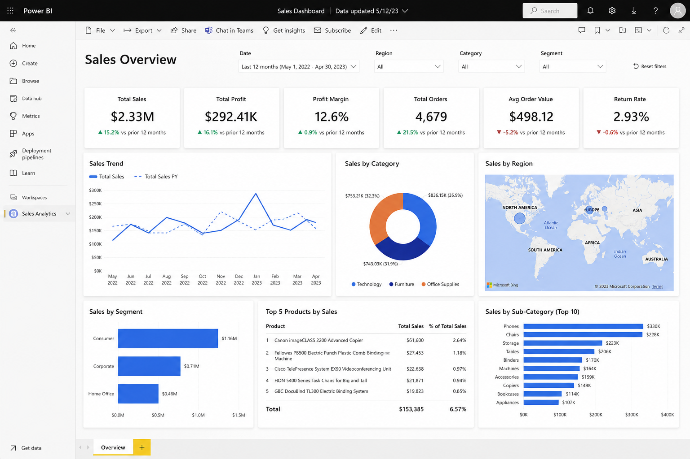

# Power BI Sales Dashboard

## Overview
This project focuses on analyzing sales performance and business KPIs using Power BI.

The dashboard helps track:
- Total Sales
- Profit Growth
- Monthly Revenue
- Top Products
- Customer Insights
- Regional Performance

## Tools Used
- Power BI
- Excel
- Data Cleaning
- Data Visualization

## Key Features
- Interactive dashboard
- KPI cards
- Sales trend analysis
- Region-wise filtering
- Dynamic charts and visuals

## Project Goal
The goal of this project was to turn raw business data into meaningful insights that can support better decision-making.

## Learning Outcome
Through this project, I improved my understanding of:
- Dashboard design
- Business analytics
- Data storytelling
- Data visualization techniques

## Dashboard Preview

## Author
Puneet Goswami
